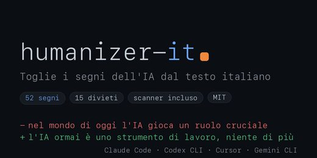
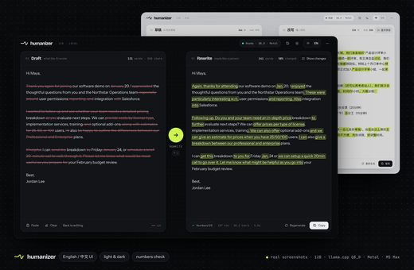
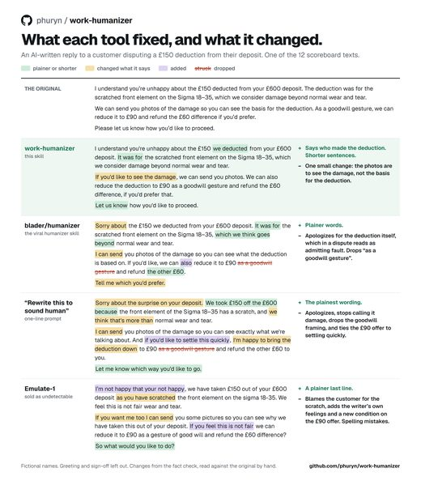

# Awesome Humanizer Skills

[中文](README.zh-CN.md)

Open-source **humanizer and anti-slop skills**: make AI-written text, code and UI read like a person made it, detect AI tells, and keep agents to a house style. English and Chinese. 232 repos, each one read and security-graded by [Agent Skills Hub](https://agentskillshub.top?utm_source=github&utm_medium=awesome-list).

Live page with filters: **[https://agentskillshub.top/best/anti-slop/](https://agentskillshub.top/best/anti-slop/?utm_source=github&utm_medium=awesome-list)** · refreshed every 8 hours

## Which one to install

We ran 26 of these end to end (23 gave a result). This is what we would pick; the [full test](#tested) is below.

- 🥇 **For English text: [sloptrim](https://github.com/seyedehsanhadi/sloptrim)**  
  The best-reading rewrites in the test (4.5 of 5) with every fact kept. Like the rest, it changes wording, not structure.
- 🥈 **For Chinese text: [Humanizer-zh](https://github.com/op7418/Humanizer-zh)**  
  3.0 of 5 with every fact kept, level with three other Chinese tools; the most used of them. None of the Chinese tools scored higher.
- 🥉 **To check a text, not rewrite it: [humanizer-skill](https://github.com/Aboudjem/humanizer-skill)**  
  The only detector that flags structure in earnest: 8 of its 38 flags were about stated lessons, tidy endings and the like.

**Skip:** AI-Text-Humanizer-App (it prepends stock transitions and reads more like AI (1 of 5)).

No tool rewrote the structure away: across 40 rewrites the stated lesson survived 26 of 26 times and the tidy ending 28 of 28. Cut the moral, leave the ending open and name specifics yourself.

*Rewriters are ranked by how human the rewrite read to the judge (1-5); detectors by how many structure issues they flag.*

## What these skills do

<table>
<tr>
<td align="center" valign="top" width="33%"><b>✍️ Writing humanizers</b> 59 repos   Rewrite AI prose so it reads human. <a href="#type-writing"><b>View the list →</b></a></td>
<td align="center" valign="top" width="33%"><b>🔍 Slop detectors</b> 80 repos  Find and score AI writing patterns. <a href="#type-detector"><b>View the list →</b></a></td>
<td align="center" valign="top" width="33%"><b>🀄 Chinese text</b> 37 repos  Take the AI flavour out of Chinese writing. <a href="#type-chinese"><b>View the list →</b></a></td>
</tr>
<tr>
<td align="center" valign="top" width="33%"><b>🧹 Code cleanup</b> 5 repos  Clean AI patterns out of code and comments. <a href="#type-code"><b>View the list →</b></a></td>
<td align="center" valign="top" width="33%"><b>🎨 UI & design taste</b> 31 repos   Steer AI-made UI away from the generic AI look. <a href="#type-design"><b>View the list →</b></a></td>
<td align="center" valign="top" width="33%"><b>📏 Style rules</b> 20 repos  Style guides and word lists agents follow. <a href="#type-rules"><b>View the list →</b></a></td>
</tr>
</table>

## Contents

- [🧪 Tested end to end](#tested)
- [✍️ Writing humanizers](#type-writing) (59)
- [🔍 Slop detectors](#type-detector) (80)
- [🀄 Chinese text](#type-chinese) (37)
- [🧹 Code cleanup](#type-code) (5)
- [🎨 UI & design taste](#type-design) (31)
- [📏 Style rules](#type-rules) (20)

## How a repo gets on the list

1. It makes AI-made output read as if a person made it, or detects or removes AI patterns in text, code or design. A general writing assistant or grammar checker does not count.
2. It is software someone can install or run, not a list of links or a placeholder.
3. It has a README. Without one it cannot be graded.
4. At 50 stars or more it is listed on topic alone. Under 50 it must also clear a README quality bar (shows it working, one-command start, a concrete outcome, complete docs), and have 5 stars.

The questions are answered by a decision model reading each README, not by hand. A repo near a cut-off can land on either side; open an issue if one is misfiled.

## 🧪 Tested end to end

On 2026-10-07 we ran 26 of these skills and 23 ran: each rewrote the same three texts (an English post, a Chinese post, a short story) in a throwaway sandbox, driven by Claude Code (Claude Opus 5.5), judged by gpt-6-astra on StoryScope's structure features ([COLM 2026](https://arxiv.org/abs/2604.03136)). Most human-reading first.

**What we found:** none rewrote the structure away. Across 40 rewrites the stated lesson survived 26/26, the tidy ending 28/28, the single track 40/40; 19 of 21 changed wording, not structure. No fact was lost.

| # | Skill | ★ | Reads human | Layer reached | AI structure removed | Facts | Detector flags | |
|---|---|---|---|---|---|---|---|---|
| 1 | [sloptrim](https://github.com/seyedehsanhadi/sloptrim) | 212 | 4.5/5 | wording | 0 | all kept | 6 (0) | [evidence](https://agentskillshub.top/best-runs/slop/seyedehsanhadi__sloptrim.html) |
| 2 | [slop-guard](https://github.com/eric-tramel/slop-guard) | 163 | 4.0/5 | wording | 0 | all kept | 5 (2) | [evidence](https://agentskillshub.top/best-runs/slop/eric-tramel__slop-guard.html) |
| 3 | [anti-slop](https://github.com/miqdadbadjuber/anti-slop) | 4,501 | 4.0/5 | wording | 1 | all kept | - | [evidence](https://agentskillshub.top/best-runs/slop/miqdadbadjuber__anti-slop.html) |
| 4 | [humanizer-stack](https://github.com/NulightJens/humanizer-stack) | 318 | 3.5/5 | structure | 1 | all kept | - | [evidence](https://agentskillshub.top/best-runs/slop/NulightJens__humanizer-stack.html) |
| 5 | [academic-humanizer](https://github.com/AIScientists-Dev/academic-humanizer) | 1,781 | 3.5/5 | wording | 0 | all kept | - | [evidence](https://agentskillshub.top/best-runs/slop/AIScientists-Dev__academic-humanizer.html) |
| 6 | [no_ai_slop_writing_rules](https://github.com/realrossmanngroup/no_ai_slop_writing_rules) | 694 | 3.5/5 | wording | 0 | all kept | - | [evidence](https://agentskillshub.top/best-runs/slop/realrossmanngroup__no_ai_slop_writing_rules.html) |
| 7 | [humanizer-skill](https://github.com/Aboudjem/humanizer-skill) | 264 | 3.3/5 | wording | 1 | all kept | 38 (8) | [evidence](https://agentskillshub.top/best-runs/slop/Aboudjem__humanizer-skill.html) |
| 8 | [humanizer](https://github.com/blader/humanizer) | 54,072 | 3.0/5 | wording | 0 | all kept | - | [evidence](https://agentskillshub.top/best-runs/slop/blader__humanizer.html) |
| 9 | [sepia](https://github.com/Nanako0129/sepia) | 2,970 | 3.0/5 | structure | 0 | all kept | - | [evidence](https://agentskillshub.top/best-runs/slop/Nanako0129__sepia.html) |
| 10 | [humanize](https://github.com/harshaneel/humanize) | 515 | 3.0/5 | wording | 1 | all kept | - | [evidence](https://agentskillshub.top/best-runs/slop/harshaneel__humanize.html) |
| 11 | [unslop](https://github.com/MohamedAbdallah-14/unslop) | 153 | 3.0/5 | wording | 1 | all kept | - | [evidence](https://agentskillshub.top/best-runs/slop/MohamedAbdallah-14__unslop.html) |
| 12 | [Humanizer-zh](https://github.com/op7418/Humanizer-zh) | 18,940 | 3.0/5 | wording | 0 | all kept | - | [evidence](https://agentskillshub.top/best-runs/slop/op7418__Humanizer-zh.html) |
| 13 | [speak-human-tw](https://github.com/Raymondhou0917/speak-human-tw) | 1,027 | 3.0/5 | wording | 0 | all kept | - | [evidence](https://agentskillshub.top/best-runs/slop/Raymondhou0917__speak-human-tw.html) |
| 14 | [De-AI-Prompt-Enhancer-Writer-Booster-SKILL](https://github.com/OUBIGFA/De-AI-Prompt-Enhancer-Writer-Booster-SKILL) | 848 | 3.0/5 | wording | 0 | all kept | - | [evidence](https://agentskillshub.top/best-runs/slop/OUBIGFA__De-AI-Prompt-Enhancer-Writer-Booster-SKILL.html) |
| 15 | [qu-ai-wei](https://github.com/LifelongLazyLearner/qu-ai-wei) | 622 | 3.0/5 | wording | 0 | all kept | - | [evidence](https://agentskillshub.top/best-runs/slop/LifelongLazyLearner__qu-ai-wei.html) |
| 16 | [stop-slop](https://github.com/hardikpandya/stop-slop) | 17,755 | 3.0/5 | wording | 1 | all kept | - | [evidence](https://agentskillshub.top/best-runs/slop/hardikpandya__stop-slop.html) |
| 17 | [StealthHumanizer](https://github.com/rudra496/StealthHumanizer) | 156 | 2.3/5 | wording | 0 | all kept | - | [evidence](https://agentskillshub.top/best-runs/slop/rudra496__StealthHumanizer.html) |
| 18 | [patina](https://github.com/devswha/patina) | 363 | 2.0/5 | wording | 0 | all kept | - | [evidence](https://agentskillshub.top/best-runs/slop/devswha__patina.html) |
| 19 | [lieflat-less-ai-tone](https://github.com/larashero3-dotcom/lieflat-less-ai-tone) | 2,303 | 2.0/5 | wording | 0 | all kept | - | [evidence](https://agentskillshub.top/best-runs/slop/larashero3-dotcom__lieflat-less-ai-tone.html) |
| 20 | [shuorenhua](https://github.com/MrGeDiao/shuorenhua) | 1,980 | 2.0/5 | wording | 0 | all kept | - | [evidence](https://agentskillshub.top/best-runs/slop/MrGeDiao__shuorenhua.html) |
| 21 | [AI-Text-Humanizer-App](https://github.com/DadaNanjesha/AI-Text-Humanizer-App) | 435 | 1.0/5 | wording | 0 | all kept | - | [evidence](https://agentskillshub.top/best-runs/slop/DadaNanjesha__AI-Text-Humanizer-App.html) |
| 22 | [vale-ai-tells](https://github.com/tbhb/vale-ai-tells) | 115 | - | detector only | - | - | 22 (2) | [evidence](https://agentskillshub.top/best-runs/slop/tbhb__vale-ai-tells.html) |
| 23 | [avoid-ai-writing](https://github.com/conorbronsdon/avoid-ai-writing) | 4,864 | - | detector only | - | - | 7 (0) | [evidence](https://agentskillshub.top/best-runs/slop/conorbronsdon__avoid-ai-writing.html) |

**Could not run:** humanize-text (Needs a Niutrans translation key besides an LLM key, and always outputs English.); AIWriteX (A desktop app that writes new articles from trending topics and posts them to WeChat; it cannot rewrite a given file.); attention-span (Changes how Claude writes its own replies; its skills start only when a person types the command.)

[All results, prompts and scripts](https://github.com/zhuyansen/agent-skills-hub/blob/main/ops/slop-runs/RESULTS.md) · [https://agentskillshub.top/best/anti-slop/#test-results](https://agentskillshub.top/best/anti-slop/?utm_source=github&utm_medium=awesome-list#test-results)

## ✍️ Writing humanizers

[Open this type on the live page, sorted by stars →](https://agentskillshub.top/best/anti-slop/?utm_source=github&utm_medium=awesome-list#type-writing)

<table><tr>
<td align="center" valign="top"> <a href="https://github.com/sgaofen/humanizer-local-model">sgaofen/humanizer-local-model</a></td>
<td align="center" valign="top"> <a href="https://github.com/phuryn/work-humanizer">phuryn/work-humanizer</a></td>
</tr></table>

| Repo | Stars | What it does | Security |
|---|---:|---|---|
| [blader/humanizer](https://github.com/blader/humanizer) | 55.4k | Agent skill that removes signs of AI-generated writing from text | [SAFE](https://agentskillshub.top/skill/blader/humanizer/?utm_source=github&utm_medium=awesome-list) |
| [lynote-ai/humanize-text](https://github.com/lynote-ai/humanize-text) | 3.3k | Open-source AI humanizer that rewrites AI-generated text into natural, human-sounding writing. Structure-first SFT + KTO training-data pipeline plus… | [SAFE](https://agentskillshub.top/skill/lynote-ai/humanize-text/?utm_source=github&utm_medium=awesome-list) |
| [Nanako0129/sepia](https://github.com/Nanako0129/sepia) | 3.1k | De-AI writing skill for any Agent Skills-compatible agent (77+ via the Skills CLI), with native plugins for Claude Code, Codex, Grok Build, and Antig… | [SAFE](https://agentskillshub.top/skill/Nanako0129/sepia/?utm_source=github&utm_medium=awesome-list) |
| [iniwap/AIWriteX](https://github.com/iniwap/AIWriteX) | 2.1k | AIWriteX - 微信公众号全自动AI工具：全网热搜舆情聚合+趋势分析+爆款选题+文章采集+一键生成排版发布 \| AI自动配图 \| 去AI味、过朱雀检测 \| 支持小红书/百家号/头条等多平台 \| 洗稿润色支持多账号 \| 专家赛道 \| 小绿书贴图 \| 短视频文案 \| 手机控制 \… | [SAFE](https://agentskillshub.top/skill/iniwap/AIWriteX/?utm_source=github&utm_medium=awesome-list) |
| [harshaneel/humanize](https://github.com/harshaneel/humanize) | 526 | Best static AI text humanizer. Two research-grounded LLM-agnostic skills that make AI writing sound human and relatable. Nine levers, 50+ peer-review… | [SAFE](https://agentskillshub.top/skill/harshaneel/humanize/?utm_source=github&utm_medium=awesome-list) |
| [DadaNanjesha/AI-Text-Humanizer-App](https://github.com/DadaNanjesha/AI-Text-Humanizer-App) | 434 | Transform AI-generated text into formal, human-like, and academic writing with ease, avoids AI detector! | [SAFE](https://agentskillshub.top/skill/DadaNanjesha/AI-Text-Humanizer-App/?utm_source=github&utm_medium=awesome-list) |
| [devswha/patina](https://github.com/devswha/patina) | 366 | AI-writing humanizer for KO/EN/ZH/JA | [SAFE](https://agentskillshub.top/skill/devswha/patina/?utm_source=github&utm_medium=awesome-list) |
| [NulightJens/humanizer-stack](https://github.com/NulightJens/humanizer-stack) | 354 | Two-pass pipeline for removing AI writing tells from outward-facing text: a surface pass plus a structural pass grounded in the StoryScope study. Pac… | [SAFE](https://agentskillshub.top/skill/NulightJens/humanizer-stack/?utm_source=github&utm_medium=awesome-list) |
| [rudra496/StealthHumanizer](https://github.com/rudra496/StealthHumanizer) | 162 | 🔓 Free open-source AI text humanizer — bypass GPTZero, Turnitin & AI detectors with 16+ Languages support. 35 providers, 4 rewrite levels, 6 Writing… | [SAFE](https://agentskillshub.top/skill/rudra496/StealthHumanizer/?utm_source=github&utm_medium=awesome-list) |
| [MohamedAbdallah-14/unslop](https://github.com/MohamedAbdallah-14/unslop) | 155 | Make AI output sound human. Strips AI-isms (sycophancy, stock vocab, hedging stacks, em-dash pileups), preserves code/URLs/headings. Plugin for Claud… | [SAFE](https://agentskillshub.top/skill/MohamedAbdallah-14/unslop/?utm_source=github&utm_medium=awesome-list) |
| [sergebulaev/x-skills](https://github.com/sergebulaev/x-skills) | 124 | X (Twitter) marketing skills for Claude Code and Codex: write tweets, threads, and replies in your voice, strip AI tells, and publish via Publora. Op… | [SAFE](https://agentskillshub.top/skill/sergebulaev/x-skills/?utm_source=github&utm_medium=awesome-list) |
| [sgaofen/humanizer-local-model](https://github.com/sgaofen/humanizer-local-model) | 123 | Rewrites AI drafts so they read like a person wrote them — runs locally, keeps the facts | [SAFE](https://agentskillshub.top/skill/sgaofen/humanizer-local-model/?utm_source=github&utm_medium=awesome-list) |
| [ehmo/slopkit](https://github.com/ehmo/slopkit) | 107 | Anti-slop skills for AI agents: slopbeth cleans the shipped writing, slopgent cleans the conversation. | [SAFE](https://agentskillshub.top/skill/ehmo/slopkit/?utm_source=github&utm_medium=awesome-list) |
| [carlosafjr-dev/humanizer-br](https://github.com/carlosafjr-dev/humanizer-br) | 95 | Skill para Claude Code que remove marcas típicas de textos gerados por IA, deixando a escrita mais natural, clara e próxima da linguagem humana. A sk… | [SAFE](https://agentskillshub.top/skill/carlosafjr-dev/humanizer-br/?utm_source=github&utm_medium=awesome-list) |
| [ksanyok/TextHumanize](https://github.com/ksanyok/TextHumanize) | 85 | Transform AI-generated text into natural human-like content. 100% offline · 25 languages · Zero dependencies · PHANTOM™ · ASH™ · Python/PHP/TypeScript | [SAFE](https://agentskillshub.top/skill/ksanyok/TextHumanize/?utm_source=github&utm_medium=awesome-list) |
| [bushrabeg/turkce-humanizer](https://github.com/bushrabeg/turkce-humanizer) | 84 | Türkçe metinlerden yapay zekâ yazım imzalarını temizleyen Claude skill'i. YZ üretimi Türkçe'yi doğal, insan-sesli Türkçe'ye dönüştürür. \| A Claude s… | [SAFE](https://agentskillshub.top/skill/bushrabeg/turkce-humanizer/?utm_source=github&utm_medium=awesome-list) |
| [phuryn/work-humanizer](https://github.com/phuryn/work-humanizer) | 81 | A humanizer for work writing: takes the AI tone out without changing what your text says or commits to. Agent Skill + evidence: blind judges, hand-ch… | [SAFE](https://agentskillshub.top/skill/phuryn/work-humanizer/?utm_source=github&utm_medium=awesome-list) |
| [Wenzhi-Ding/wenzhi-plugins](https://github.com/Wenzhi-Ding/wenzhi-plugins) | 76 | coding agent 行为插件仓库：humanize 注入「说人话」写作规则，skill-stats 统计技能触发与来源。 | [SAFE](https://agentskillshub.top/skill/Wenzhi-Ding/wenzhi-plugins/?utm_source=github&utm_medium=awesome-list) |
| [asavvin-pixel/unslop](https://github.com/asavvin-pixel/unslop) | 74 | English text humanizer for Claude: typography, vocabulary, structure. Calibrates to your voice. Built on the UMD / Google DeepMind study and Wikipedi… | [SAFE](https://agentskillshub.top/skill/asavvin-pixel/unslop/?utm_source=github&utm_medium=awesome-list) |
| [sanjaysah101/humanize-ai](https://github.com/sanjaysah101/humanize-ai) | 64 | A sophisticated system for transforming AI-generated text into natural, human-like content using advanced NLP techniques and mathematical models. | [SAFE](https://agentskillshub.top/skill/sanjaysah101/humanize-ai/?utm_source=github&utm_medium=awesome-list) |
| [zhouying20/HMGC](https://github.com/zhouying20/HMGC) | 60 | COLING'24 Humanizing Machine-Generated Content: Evading AI-Text Detection through Adversarial Attack | [SAFE](https://agentskillshub.top/skill/zhouying20/HMGC/?utm_source=github&utm_medium=awesome-list) |
| [lguz/humanize-writing-skill](https://github.com/lguz/humanize-writing-skill) | 54 | Rewrite AI-generated text to sound human. 3-pass editing system with 36+ banned words, 10 structural patterns, and a quality checklist. Works with an… | [SAFE](https://agentskillshub.top/skill/lguz/humanize-writing-skill/?utm_source=github&utm_medium=awesome-list) |
| [chengez/Adversarial-Paraphrasing](https://github.com/chengez/Adversarial-Paraphrasing) | 52 | [NeurIPS 2025] Implementation for paper "Adversarial Paraphrasing: A Universal Attack for Humanizing AI-Generated Text" | [SAFE](https://agentskillshub.top/skill/chengez/Adversarial-Paraphrasing/?utm_source=github&utm_medium=awesome-list) |
| [ZAYUVALYA/AI-Text-Humanizer](https://github.com/ZAYUVALYA/AI-Text-Humanizer) | 51 | ZAYUVALYA - AI Humanizer is a developing tool designed to rephrase AI-generated text to make it more natural and reduce detection by AI content detec… | [SAFE](https://agentskillshub.top/skill/ZAYUVALYA/AI-Text-Humanizer/?utm_source=github&utm_medium=awesome-list) |
| [thevseprod/humanizer-ru](https://github.com/thevseprod/humanizer-ru) | 42 | Очеловечить текст нейросети: убирает длинное тире, канцелярит и штампы ChatGPT, не трогая факты. Правила для любой нейросети + скилл для Claude Code,… | [SAFE](https://agentskillshub.top/skill/thevseprod/humanizer-ru/?utm_source=github&utm_medium=awesome-list) |
| [glaforge/deslopify](https://github.com/glaforge/deslopify) | 38 | A Gemini CLI skill to make text more genuine, natural, and free of AI tropes. | [SAFE](https://agentskillshub.top/skill/glaforge/deslopify/?utm_source=github&utm_medium=awesome-list) |
| [CBIhalsen/text-rewriter](https://github.com/CBIhalsen/text-rewriter) | 31 | this is the text-rewriter-python repository, an open-source project that provides a python script to "humanize" ai-generated text. the script makes t… | [SAFE](https://agentskillshub.top/skill/CBIhalsen/text-rewriter/?utm_source=github&utm_medium=awesome-list) |
| [bejek/humanizer-czech](https://github.com/bejek/humanizer-czech) | 24 | Czech AI text humanizer (český humanizér AI textu). Detects and rewrites 27 AI writing patterns specific to Czech language. Dual-pass system: rewrite… | [SAFE](https://agentskillshub.top/skill/bejek/humanizer-czech/?utm_source=github&utm_medium=awesome-list) |
| [amanmaqsood/prose-humanizer](https://github.com/amanmaqsood/prose-humanizer) | 21 | A universal AI writing skill that turns generic drafts into specific, truthful, voice-consistent prose. | [SAFE](https://agentskillshub.top/skill/amanmaqsood/prose-humanizer/?utm_source=github&utm_medium=awesome-list) |
| [yyx20202020/natural-writing-skill](https://github.com/yyx20202020/natural-writing-skill) | 17 | 中英文自然写作与去 AI 味 Skill：支持事实保护、文风校准、场景路由和可审查提示词。 | [SAFE](https://agentskillshub.top/skill/yyx20202020/natural-writing-skill/?utm_source=github&utm_medium=awesome-list) |
| [hjongc/humanizer-kr](https://github.com/hjongc/humanizer-kr) | 16 | AI 티 나는 한국어를 사람 말처럼, 맥락에 맞게 고치는 Codex·Claude Code 스킬 | [SAFE](https://agentskillshub.top/skill/hjongc/humanizer-kr/?utm_source=github&utm_medium=awesome-list) |
| [dotoricode/korean-humanizer](https://github.com/dotoricode/korean-humanizer) | 15 | Korean humanizer prompt and skill for removing the usual AI smell from generated writing. | [SAFE](https://agentskillshub.top/skill/dotoricode/korean-humanizer/?utm_source=github&utm_medium=awesome-list) |
| [msdanyg/humanize-pro](https://github.com/msdanyg/humanize-pro) | 13 | Claude skill that goes past word-list humanizers: strips the full catalog of AI tells, refits the text to its channel (LinkedIn, X, cold email, Slack… | [SAFE](https://agentskillshub.top/skill/msdanyg/humanize-pro/?utm_source=github&utm_medium=awesome-list) |
| [shreyas-makes/deslopify](https://github.com/shreyas-makes/deslopify) | 13 | Make the AI writing sound more humane | [SAFE](https://agentskillshub.top/skill/shreyas-makes/deslopify/?utm_source=github&utm_medium=awesome-list) |
| [odinfree/stop-slop-refined](https://github.com/odinfree/stop-slop-refined) | 12 | A public writing skill for removing common AI patterns from prose. | [SAFE](https://agentskillshub.top/skill/odinfree/stop-slop-refined/?utm_source=github&utm_medium=awesome-list) |
| [machinemade-mm/humanmade-antislop](https://github.com/machinemade-mm/humanmade-antislop) | 11 | Anti-AI slop scientific writing skill for Claude Code. Or: Scientific writing with a human voice. | [SAFE](https://agentskillshub.top/skill/machinemade-mm/humanmade-antislop/?utm_source=github&utm_medium=awesome-list) |
| [walterwritesai/walter-skills](https://github.com/walterwritesai/walter-skills) | 10 | Free Claude skills for SEO content: AI humanizer, AI detection bypass, keyword preservation, agency QC, local SEO, programmatic SEO, content repurpos… | [SAFE](https://agentskillshub.top/skill/walterwritesai/walter-skills/?utm_source=github&utm_medium=awesome-list) |
| [Albert-Lsk/alskai-deai-writer](https://github.com/Albert-Lsk/alskai-deai-writer) | 9 | 去除AI生成文本的AI味，支持4种风格(专业商务/技术科普/亲和对话/学术研究) | [SAFE](https://agentskillshub.top/skill/Albert-Lsk/alskai-deai-writer/?utm_source=github&utm_medium=awesome-list) |
| [LeahLiang/humanizer](https://github.com/LeahLiang/humanizer) | 9 | 降AI率改写Skill，包括知网、维普、Turnitin等AI检测平台。支持中英文，不引入错误、口语或过于复杂的语言，保持可读性和学术规范。官网地址为https://ushallpass.ai/ | [SAFE](https://agentskillshub.top/skill/LeahLiang/humanizer/?utm_source=github&utm_medium=awesome-list) |
| [OthmanAdi/humanizer-semitic](https://github.com/OthmanAdi/humanizer-semitic) | 9 | AI text humanizer skills for Arabic (MSA, Egyptian, Levantine) and Hebrew — zero AI tells | [SAFE](https://agentskillshub.top/skill/OthmanAdi/humanizer-semitic/?utm_source=github&utm_medium=awesome-list) |
| [behzadsp/humanized-writing-skill](https://github.com/behzadsp/humanized-writing-skill) | 9 | Agent-agnostic skill for writing natural, humanized, SEO-focused articles and blog content without robotic AI patterns. | [SAFE](https://agentskillshub.top/skill/behzadsp/humanized-writing-skill/?utm_source=github&utm_medium=awesome-list) |
| [dixon2004/ai-humanizer](https://github.com/dixon2004/ai-humanizer) | 9 | AI Humanizer is a free, open-source tool that rewrites AI-generated text to sound more natural, fluent, and human. | [SAFE](https://agentskillshub.top/skill/dixon2004/ai-humanizer/?utm_source=github&utm_medium=awesome-list) |
| [timolabs-ai/claude-humanize-skill](https://github.com/timolabs-ai/claude-humanize-skill) | 9 | Claude Code skill (/humanize). Strips AI writing patterns from content via five editorial layers: vocabulary, sentence shape, bullet rhythm, paragrap… | [SAFE](https://agentskillshub.top/skill/timolabs-ai/claude-humanize-skill/?utm_source=github&utm_medium=awesome-list) |
| [KondrashovDenis/claude-humanizer-ru-skill](https://github.com/KondrashovDenis/claude-humanizer-ru-skill) | 8 | Claude Code skill для чистки русских текстов от AI-штампов. Адаптация blader/humanizer: канцелярит, кальки, раздутая значимость + типографическая дег… | [SAFE](https://agentskillshub.top/skill/KondrashovDenis/claude-humanizer-ru-skill/?utm_source=github&utm_medium=awesome-list) |
| [evergreentree97/K-Humanizer](https://github.com/evergreentree97/K-Humanizer) | 8 | An Agent Skill that makes LLM-written Korean sound natural to Korean readers while preserving facts, numbers, and domain-specific terminology. | [SAFE](https://agentskillshub.top/skill/evergreentree97/K-Humanizer/?utm_source=github&utm_medium=awesome-list) |
| [ferr079/humanizer-fr](https://github.com/ferr079/humanizer-fr) | 8 | Fork français du skill Claude Code « humanizer » (blader/humanizer v3.1.0, MIT) : 29 motifs d'écriture IA adaptés au français, installable en plugin | [SAFE](https://agentskillshub.top/skill/ferr079/humanizer-fr/?utm_source=github&utm_medium=awesome-list) |
| [nordefors-max/claude-humanizer-svenska](https://github.com/nordefors-max/claude-humanizer-svenska) | 8 | Claude skill that removes AI writing patterns from Swedish professional text. Covers 16 pattern types including significance inflation, nominalizatio… | [SAFE](https://agentskillshub.top/skill/nordefors-max/claude-humanizer-svenska/?utm_source=github&utm_medium=awesome-list) |
| [pielas-activy/humanizer-pl](https://github.com/pielas-activy/humanizer-pl) | 8 | Dwujęzyczny (PL+EN) humanizer / de-slop skill dla Claude Code. Fork blader/humanizer + warstwa polskiej naturalności + eksperyment: czy Bielik (polsk… | [SAFE](https://agentskillshub.top/skill/pielas-activy/humanizer-pl/?utm_source=github&utm_medium=awesome-list) |
| [Floka-as/floka-marketplace](https://github.com/Floka-as/floka-marketplace) | 7 | Claude Code plugins from Floka AS — Norwegian-flavored AI tooling: humanizer (AI-writing scrub + Norwegian patterns), board (build a personal advisor… | [SAFE](https://agentskillshub.top/skill/Floka-as/floka-marketplace/?utm_source=github&utm_medium=awesome-list) |
| [aeopress/writing-skills.TW](https://github.com/aeopress/writing-skills.TW) | 7 | 繁體中文寫作 skill 工具鏈 for Claude Code：humanizer-tw（去 AI 味）+ good-writing-zh（節奏打磨：PG／余光中／王鼎鈞 + 技術文件保守模式）+ fable-econ／fable-explore（Amanda Askell 寓言式概念學習） | [SAFE](https://agentskillshub.top/skill/aeopress/writing-skills.TW/?utm_source=github&utm_medium=awesome-list) |
| [diaiq/claude-skill-humanizer](https://github.com/diaiq/claude-skill-humanizer) | 7 | Free Claude Code skill to humanize AI-generated text. Bypass GPTZero, Turnitin, and other AI detectors. Powered by DiaIQ. | [SAFE](https://agentskillshub.top/skill/diaiq/claude-skill-humanizer/?utm_source=github&utm_medium=awesome-list) |
| [musharrafff/humanizer_v2](https://github.com/musharrafff/humanizer_v2) | 7 | Write like some of the best writers of our time. This skill goes beyond removing AI patterns from writing and writes like an actual human | [SAFE](https://agentskillshub.top/skill/musharrafff/humanizer_v2/?utm_source=github&utm_medium=awesome-list) |
| [Khushiyant/humano](https://github.com/Khushiyant/humano) | 5 | A Python package for humanizing AI-generated or robotic text using techniques like DIPPER, HMGC, and ADAT. | [SAFE](https://agentskillshub.top/skill/Khushiyant/humano/?utm_source=github&utm_medium=awesome-list) |
| [daniel-bogale/anti-ai-writing-humanizer](https://github.com/daniel-bogale/anti-ai-writing-humanizer) | 5 | Humanize AI-written text — a portable agent skill that writes or rewrites prose to remove AI tells. Works in Claude Code, Cursor, Codex, OpenClaw. | [SAFE](https://agentskillshub.top/skill/daniel-bogale/anti-ai-writing-humanizer/?utm_source=github&utm_medium=awesome-list) |
| [durmazoguzhan/turkish-humanify](https://github.com/durmazoguzhan/turkish-humanify) | 5 | Turkish humanizer skill for Claude and Claude Code. Rewrites AI-sounding Turkish into Turkish a person would have written: native sentence architectu… | [SAFE](https://agentskillshub.top/skill/durmazoguzhan/turkish-humanify/?utm_source=github&utm_medium=awesome-list) |
| [humanizer-tools/slop-humanizer](https://github.com/humanizer-tools/slop-humanizer) | 5 | A Claude skill that strips AI writing patterns and rewrites text to sound human. Synthesized from 8 humanizer repos. | [SAFE](https://agentskillshub.top/skill/humanizer-tools/slop-humanizer/?utm_source=github&utm_medium=awesome-list) |
| [ilyautov/humanizer-it](https://github.com/ilyautov/humanizer-it) | 5 | Remove AI traces from Italian text — opensource (MIT) skill for Claude. The «IA-taliano»: English calques, nominal burocratese, missing intercalari/c… | [SAFE](https://agentskillshub.top/skill/ilyautov/humanizer-it/?utm_source=github&utm_medium=awesome-list) |
| [matsutouya/humanizer-ja](https://github.com/matsutouya/humanizer-ja) | 5 | Claude Code skill that removes signs of AI-generated writing from Japanese text | [SAFE](https://agentskillshub.top/skill/matsutouya/humanizer-ja/?utm_source=github&utm_medium=awesome-list) |
| [rephrasyai/rephrasy-skills](https://github.com/rephrasyai/rephrasy-skills) | 5 | Free content skills for AI agents. Humanize AI text, keep your keywords intact, ship agency-quality drafts. Free, MIT, works across Claude Code, Code… | [SAFE](https://agentskillshub.top/skill/rephrasyai/rephrasy-skills/?utm_source=github&utm_medium=awesome-list) |

## 🔍 Slop detectors

[Open this type on the live page, sorted by stars →](https://agentskillshub.top/best/anti-slop/?utm_source=github&utm_medium=awesome-list#type-detector)

| Repo | Stars | What it does | Security |
|---|---:|---|---|
| [epoko77-ai/im-not-ai](https://github.com/epoko77-ai/im-not-ai) | 5.9k | AI가 쓴 한글을 사람 글처럼 윤문하는 Claude 스킬 — Korean AI-text humanizer: detects and rewrites translationese, mechanical parallelism, and 71 other AI tells | [SAFE](https://agentskillshub.top/skill/epoko77-ai/im-not-ai/?utm_source=github&utm_medium=awesome-list) |
| [dmmulroy/anti-slop](https://github.com/dmmulroy/anti-slop) | 5.4k | Opinionated Oxlint rules for rejecting low-evidence TypeScript and JavaScript patterns | [SAFE](https://agentskillshub.top/skill/dmmulroy/anti-slop/?utm_source=github&utm_medium=awesome-list) |
| [conorbronsdon/avoid-ai-writing](https://github.com/conorbronsdon/avoid-ai-writing) | 4.9k | Skill that audits and rewrites content to remove AI writing patterns. Use it with your favorite agents including Claude Code, OpenClaw, Codex, and He… | [SAFE](https://agentskillshub.top/skill/conorbronsdon/avoid-ai-writing/?utm_source=github&utm_medium=awesome-list) |
| [Jakeschincariol/linkedin-agent-skill](https://github.com/Jakeschincariol/linkedin-agent-skill) | 1.7k | Eleven free Claude skills that run a LinkedIn account: posts off 21 hook formulas, comments, replies, profile score, weekly plan, and a humanizer tha… | [SAFE](https://agentskillshub.top/skill/Jakeschincariol/linkedin-agent-skill/?utm_source=github&utm_medium=awesome-list) |
| [peakoss/anti-slop](https://github.com/peakoss/anti-slop) | 843 | A GitHub action that detects and automatically closes low-quality and AI slop PRs. | [SAFE](https://agentskillshub.top/skill/peakoss/anti-slop/?utm_source=github&utm_medium=awesome-list) |
| [theclaymethod/unslop](https://github.com/theclaymethod/unslop) | 518 | An agent skill to de-AI your writing | [SAFE](https://agentskillshub.top/skill/theclaymethod/unslop/?utm_source=github&utm_medium=awesome-list) |
| [ilyautov/humanizer-ru](https://github.com/ilyautov/humanizer-ru) | 432 | humanizer-ru: редактура русского текста для AI-агентов. Убирает канцелярит и шаблонные обороты, сверяет смысл и факты. 67 признаков, 21 жёсткий запре… | [SAFE](https://agentskillshub.top/skill/ilyautov/humanizer-ru/?utm_source=github&utm_medium=awesome-list) |
| [Aboudjem/humanizer-skill](https://github.com/Aboudjem/humanizer-skill) | 266 | Free, open-source AI writing humanizer and detector. 55 patterns, 5 voices, a 0-100 AI-tell score, and nothing leaves your machine. | [SAFE](https://agentskillshub.top/skill/Aboudjem/humanizer-skill/?utm_source=github&utm_medium=awesome-list) |
| [talkstream/ru-text](https://github.com/talkstream/ru-text) | 261 | Russian text quality for AI agents — neuroslop cleanup, typography, information style, editorial standards, UX writing, business correspondence. Scor… | [SAFE](https://agentskillshub.top/skill/talkstream/ru-text/?utm_source=github&utm_medium=awesome-list) |
| [lynote-ai/humanize-text-skill](https://github.com/lynote-ai/humanize-text-skill) | 242 | Free AI Humanizer: Humanize AI Text Online | [SAFE](https://agentskillshub.top/skill/lynote-ai/humanize-text-skill/?utm_source=github&utm_medium=awesome-list) |
| [seyedehsanhadi/sloptrim](https://github.com/seyedehsanhadi/sloptrim) | 233 | A local detector for AI-writing patterns. Scores every prose file your agent saves. Python standard library only, no network, no model. | [SAFE](https://agentskillshub.top/skill/seyedehsanhadi/sloptrim/?utm_source=github&utm_medium=awesome-list) |
| [smixs/humanizer-ru](https://github.com/smixs/humanizer-ru) | 187 | Skill для AI-агентов (Claude Code, Codex, OpenClaw, Hermes): убирает 37 признаков AI-генерации из русского текста и проверяет, писала ли его нейросет… | [SAFE](https://agentskillshub.top/skill/smixs/humanizer-ru/?utm_source=github&utm_medium=awesome-list) |
| [marmbiz/humanizer-de](https://github.com/marmbiz/humanizer-de) | 171 | Deutscher Text-Humanizer für Claude Code & Codex. Redigiert KI-Floskeln, schützt deine Schreibstimme und prüft 72 deutsche Muster quellentreu. | [SAFE](https://agentskillshub.top/skill/marmbiz/humanizer-de/?utm_source=github&utm_medium=awesome-list) |
| [eric-tramel/slop-guard](https://github.com/eric-tramel/slop-guard) | 165 | Slop Scoring to Stop Slop | [SAFE](https://agentskillshub.top/skill/eric-tramel/slop-guard/?utm_source=github&utm_medium=awesome-list) |
| [Heyosseus/sloppy](https://github.com/Heyosseus/sloppy) | 156 | Static analysis for the debt AI agents leave in PHP: 26 rules, Claude Code hooks, git-diff review, a Rector and Pint fix pass, Pest expectations, CI… | [SAFE](https://agentskillshub.top/skill/Heyosseus/sloppy/?utm_source=github&utm_medium=awesome-list) |
| [Akimiya-z/codex-guard](https://github.com/Akimiya-z/codex-guard) | 136 | Quality gate for AI/Codex-generated pull requests: blocks TODO leftovers, leaked secrets, sloppy commits and red CI before they reach main. | [SAFE](https://agentskillshub.top/skill/Akimiya-z/codex-guard/?utm_source=github&utm_medium=awesome-list) |
| [manavmishra/ZeroSlop](https://github.com/manavmishra/ZeroSlop) | 133 | Open-source Agent Skill that finds and removes AI slop from your writing | [SAFE](https://agentskillshub.top/skill/manavmishra/ZeroSlop/?utm_source=github&utm_medium=awesome-list) |
| [brandonwise/humanizer](https://github.com/brandonwise/humanizer) | 127 | OpenClaw skill that detects and removes signs of AI-generated writing, making text sound natural and human. Based on Wikipedia's Signs of AI Writing. | [SAFE](https://agentskillshub.top/skill/brandonwise/humanizer/?utm_source=github&utm_medium=awesome-list) |
| [Vladimir-Human/humanizer-ru](https://github.com/Vladimir-Human/humanizer-ru) | 126 | Проверяемая гигиена вставки из чата для русского текста | [SAFE](https://agentskillshub.top/skill/Vladimir-Human/humanizer-ru/?utm_source=github&utm_medium=awesome-list) |
| [crabin/paper-humanizer-skill](https://github.com/crabin/paper-humanizer-skill) | 124 | 中英文学术文本润色与人性化skill，用于去除 AI 生成的痕迹，同时严格保持事实准确性。 | [SAFE](https://agentskillshub.top/skill/crabin/paper-humanizer-skill/?utm_source=github&utm_medium=awesome-list) |
| [tbhb/vale-ai-tells](https://github.com/tbhb/vale-ai-tells) | 117 | In today's rapidly evolving landscape, vale-ai-tells is a comprehensive, cutting-edge Vale style package that empowers writers to seamlessly delve in… | [SAFE](https://agentskillshub.top/skill/tbhb/vale-ai-tells/?utm_source=github&utm_medium=awesome-list) |
| [qin1473692580-ux/oh-story-claudecode](https://github.com/qin1473692580-ux/oh-story-claudecode) | 104 | 网文/小说写作 skill 包，覆盖长篇与短篇网络小说的扫榜、拆文、写作、去AI味、封面图全流程 | [SAFE](https://agentskillshub.top/skill/qin1473692580-ux/oh-story-claudecode/?utm_source=github&utm_medium=awesome-list) |
| [Nopon-Knowledge/huawei-cup-modeling-skill](https://github.com/Nopon-Knowledge/huawei-cup-modeling-skill) | 99 | 论文去 AI 味 · AI 痕迹检测 · 学术润色｜面向华为杯中国研究生数学建模竞赛的 Codex Skill，支持逐句诊断、去模板化改写、图表优化、规则核验与提交审计，保留研究事实与引文。 | [SAFE](https://agentskillshub.top/skill/Nopon-Knowledge/huawei-cup-modeling-skill/?utm_source=github&utm_medium=awesome-list) |
| [flamehaven01/AI-SLOP-Detector](https://github.com/flamehaven01/AI-SLOP-Detector) | 99 | Stop shipping AI slop. Detects empty functions, fake documentation, and inflated comments in AI-generated code. Production-ready. | [SAFE](https://agentskillshub.top/skill/flamehaven01/AI-SLOP-Detector/?utm_source=github&utm_medium=awesome-list) |
| [distil-labs/distil-ai-slop-detector](https://github.com/distil-labs/distil-ai-slop-detector) | 95 | Detect AI-generated text locally in your browser | [SAFE](https://agentskillshub.top/skill/distil-labs/distil-ai-slop-detector/?utm_source=github&utm_medium=awesome-list) |
| [misbahsy/anti-ai-slop](https://github.com/misbahsy/anti-ai-slop) | 95 | An agent skill with multiple gates to check and to remove any AI slop. Use it with codex/claude code or any of your favorite AI tools. | [SAFE](https://agentskillshub.top/skill/misbahsy/anti-ai-slop/?utm_source=github&utm_medium=awesome-list) |
| [DadaNanjesha/AI-content-detector-Humanizer](https://github.com/DadaNanjesha/AI-content-detector-Humanizer) | 92 | A comprehensive web application that detects AI-generated content in PDF documents and transforms AI text into natural human-like writing. Built with… | [SAFE](https://agentskillshub.top/skill/DadaNanjesha/AI-content-detector-Humanizer/?utm_source=github&utm_medium=awesome-list) |
| [rsionnach/sloppylint](https://github.com/rsionnach/sloppylint) | 91 | Python AI Slop Detector - Find over-engineering, hallucinations, and dead code in Python codebases | [SAFE](https://agentskillshub.top/skill/rsionnach/sloppylint/?utm_source=github&utm_medium=awesome-list) |
| [airlock-hq/airlock](https://github.com/airlock-hq/airlock) | 86 | All slop must die. Airlock is where every git push turns into a slop-free PR. | [SAFE](https://agentskillshub.top/skill/airlock-hq/airlock/?utm_source=github&utm_medium=awesome-list) |
| [gouwsxander/slop-detector](https://github.com/gouwsxander/slop-detector) | 62 | End-to-end implementation of an AI writing detector | [SAFE](https://agentskillshub.top/skill/gouwsxander/slop-detector/?utm_source=github&utm_medium=awesome-list) |
| [AgriciDaniel/anti-slop](https://github.com/AgriciDaniel/anti-slop) | 61 | Find and repair substance defects in AI-assisted prose, code, docs, and agent output. Reports defects, never authorship. Structural tests over model… | [SAFE](https://agentskillshub.top/skill/AgriciDaniel/anti-slop/?utm_source=github&utm_medium=awesome-list) |
| [Text2Go/ai-humanizer-mcp-server](https://github.com/Text2Go/ai-humanizer-mcp-server) | 61 | A powerful Model Context Protocol (MCP) server that helps refine AI-generated content to sound more natural and human-like. Built with advanced AI de… | [SAFE](https://agentskillshub.top/skill/Text2Go/ai-humanizer-mcp-server/?utm_source=github&utm_medium=awesome-list) |
| [millionco/deslop-js](https://github.com/millionco/deslop-js) | 60 | Deslop JavaScript code | [SAFE](https://agentskillshub.top/skill/millionco/deslop-js/?utm_source=github&utm_medium=awesome-list) |
| [pablocaeg/sloptotal](https://github.com/pablocaeg/sloptotal) | 59 | Open-source AI text detector and ChatGPT detector: 23 engines, one calibrated score, every number measured on a public benchmark. Self-hosted, runs o… | [SAFE](https://agentskillshub.top/skill/pablocaeg/sloptotal/?utm_source=github&utm_medium=awesome-list) |
| [ilien-dev/quiron](https://github.com/ilien-dev/quiron) | 57 | AI humanizer skill for Claude Code, Codex and Cursor. Removes AI slop and the signs of AI writing, then measures the rewrite against human baselines. | [SAFE](https://agentskillshub.top/skill/ilien-dev/quiron/?utm_source=github&utm_medium=awesome-list) |
| [Nimblesite/Deslop](https://github.com/Nimblesite/Deslop) | 56 |  | [SAFE](https://agentskillshub.top/skill/Nimblesite/Deslop/?utm_source=github&utm_medium=awesome-list) |
| [apurvrdx1/tagore](https://github.com/apurvrdx1/tagore) | 54 | Make AI-generated prose sound human. 29-pattern catalog + 8-rule operating system + 8-dimension scoring rubric. Works with Claude Code, OpenCode, Cop… | [SAFE](https://agentskillshub.top/skill/apurvrdx1/tagore/?utm_source=github&utm_medium=awesome-list) |
| [stephenlzc/humanize-mba-text-skill](https://github.com/stephenlzc/humanize-mba-text-skill) | 51 | 去除中文MBA论文AI写作痕迹的检测与改写工具 \| AI writing pattern detection and removal tool for Chinese MBA thesis | [SAFE](https://agentskillshub.top/skill/stephenlzc/humanize-mba-text-skill/?utm_source=github&utm_medium=awesome-list) |
| [humanizerai/agent-skills](https://github.com/humanizerai/agent-skills) | 49 | HumanizerAI Agent Skills for Claude Code and Codex - AI detection and text humanization | [SAFE](https://agentskillshub.top/skill/humanizerai/agent-skills/?utm_source=github&utm_medium=awesome-list) |
| [mmartoccia/grain](https://github.com/mmartoccia/grain) | 34 | Anti-slop linter for AI-assisted codebases | [SAFE](https://agentskillshub.top/skill/mmartoccia/grain/?utm_source=github&utm_medium=awesome-list) |
| [scale-venture-partners/windbag](https://github.com/scale-venture-partners/windbag) | 26 | Anti-slop linter: catches comments that narrate change history instead of a current constraint (Python/JS/TS/Terraform) | [SAFE](https://agentskillshub.top/skill/scale-venture-partners/windbag/?utm_source=github&utm_medium=awesome-list) |
| [dripips/plain-prose](https://github.com/dripips/plain-prose) | 25 | Agent skill that removes AI writing patterns from English, Russian and German prose. Merges stop-slop and avoid-ai-writing, adds a zero-dependency ch… | [SAFE](https://agentskillshub.top/skill/dripips/plain-prose/?utm_source=github&utm_medium=awesome-list) |
| [vstorm-co/content-skills](https://github.com/vstorm-co/content-skills) | 25 | Content studio skill pack for coding agents — blog, social, slides, video, infographics — all brand-aware with built-in anti-slop. Works with Claude… | [SAFE](https://agentskillshub.top/skill/vstorm-co/content-skills/?utm_source=github&utm_medium=awesome-list) |
| [drunkrhin0/antislop](https://github.com/drunkrhin0/antislop) | 24 | By slop for slop, to remove slop in an AI slop world. | [SAFE](https://agentskillshub.top/skill/drunkrhin0/antislop/?utm_source=github&utm_medium=awesome-list) |
| [momo2young/humanize-academic-writing](https://github.com/momo2young/humanize-academic-writing) | 24 | An AI skill (Cursor/ Claude) for transforming AI-generated academic text into natural, human-like scholarly writing/ 一个专为社科学者设计的 Cursor AI Skills (Cl… | [SAFE](https://agentskillshub.top/skill/momo2young/humanize-academic-writing/?utm_source=github&utm_medium=awesome-list) |
| [walidboulanouar/anti-ai-slop](https://github.com/walidboulanouar/anti-ai-slop) | 24 | CLI to detect and remove AI-slop words and em dashes | [SAFE](https://agentskillshub.top/skill/walidboulanouar/anti-ai-slop/?utm_source=github&utm_medium=awesome-list) |
| [allanta8/slop-check](https://github.com/allanta8/slop-check) | 19 | Anti-slop content audit skill for X, ViewFT, LinkedIn, and long-form posts. | [SAFE](https://agentskillshub.top/skill/allanta8/slop-check/?utm_source=github&utm_medium=awesome-list) |
| [badmuriss/unslop](https://github.com/badmuriss/unslop) | 19 | Strip AI writing tells at two layers: surface (Wikipedia Signs of AI writing) + narrative (StoryScope, arXiv:2604.03136). A model-agnostic LLM skill. | [SAFE](https://agentskillshub.top/skill/badmuriss/unslop/?utm_source=github&utm_medium=awesome-list) |
| [dabit3/deslop](https://github.com/dabit3/deslop) | 19 | Detect and remove AI-generated code patterns (slop) from your branches | [SAFE](https://agentskillshub.top/skill/dabit3/deslop/?utm_source=github&utm_medium=awesome-list) |
| [noeigenstate/AI-Writing-without-AI-feel](https://github.com/noeigenstate/AI-Writing-without-AI-feel) | 19 | 公众号、博客、技术等文章一键去AI味道，一键蒸馏自己的写作风格，已融合目前主流的写作skills | [SAFE](https://agentskillshub.top/skill/noeigenstate/AI-Writing-without-AI-feel/?utm_source=github&utm_medium=awesome-list) |
| [adamdunkels/deslop-text](https://github.com/adamdunkels/deslop-text) | 18 | Claude skill that removes 30 tell-tale signs of AI-written text | [SAFE](https://agentskillshub.top/skill/adamdunkels/deslop-text/?utm_source=github&utm_medium=awesome-list) |
| [comol/Humanizer_RU](https://github.com/comol/Humanizer_RU) | 16 | Русский Humanizer: Agent Skill и линтер читаемости для LLM-агентов | [SAFE](https://agentskillshub.top/skill/comol/Humanizer_RU/?utm_source=github&utm_medium=awesome-list) |
| [skew202/antislop](https://github.com/skew202/antislop) | 16 | A blazing-fast, multi-language linter for detecting AI-generated code slop | [SAFE](https://agentskillshub.top/skill/skew202/antislop/?utm_source=github&utm_medium=awesome-list) |
| [huangziyuan-general/dsh-novel-forge](https://github.com/huangziyuan-general/dsh-novel-forge) | 15 | DSH 小说锻炉：把 AI 长篇写作通病变成代码强制的硬约束（事实账本/上下文包/阶段门禁/零费用去AI味扫描/确定性审计/提案制修订）。Novel-writing guardrails plugin for DeepSeek Harness (DSH). | [SAFE](https://agentskillshub.top/skill/huangziyuan-general/dsh-novel-forge/?utm_source=github&utm_medium=awesome-list) |
| [cglabs-ai/guardian](https://github.com/cglabs-ai/guardian) | 12 | Stop AI slop before it hits your codebase | [SAFE](https://agentskillshub.top/skill/cglabs-ai/guardian/?utm_source=github&utm_medium=awesome-list) |
| [skyzer/deslop-the-copy](https://github.com/skyzer/deslop-the-copy) | 12 | Portable Agent Skill that removes AI writing patterns while preserving the writer voice. Works with Claude Code, Codex, OpenClaw, Cursor, and more. | [SAFE](https://agentskillshub.top/skill/skyzer/deslop-the-copy/?utm_source=github&utm_medium=awesome-list) |
| [styrene-lab/lipstyk](https://github.com/styrene-lab/lipstyk) | 12 | Anti-AI-slop code analysis — detects machine-generated code patterns across Rust, TS/JS, Python, HTML/CSS | [SAFE](https://agentskillshub.top/skill/styrene-lab/lipstyk/?utm_source=github&utm_medium=awesome-list) |
| [MauroPello/stop-the-slop](https://github.com/MauroPello/stop-the-slop) | 11 | 🚫 Spot AI-generated YouTube scripts and content farms in real-time. Open-source browser extension for Chrome & Firefox with thumbnail badges and sent… | [SAFE](https://agentskillshub.top/skill/MauroPello/stop-the-slop/?utm_source=github&utm_medium=awesome-list) |
| [Octember/stupify](https://github.com/Octember/stupify) | 11 | anti-slop code reviewer | [SAFE](https://agentskillshub.top/skill/Octember/stupify/?utm_source=github&utm_medium=awesome-list) |
| [TinyFrontier/anti-slop-py](https://github.com/TinyFrontier/anti-slop-py) | 11 | A deterministic Python linter that catches AI coding agents silencing type checkers without adding evidence. | [SAFE](https://agentskillshub.top/skill/TinyFrontier/anti-slop-py/?utm_source=github&utm_medium=awesome-list) |
| [beavis07/slop-detector](https://github.com/beavis07/slop-detector) | 11 | AI Slop to detect AI Slop | [SAFE](https://agentskillshub.top/skill/beavis07/slop-detector/?utm_source=github&utm_medium=awesome-list) |
| [cm2435/slopcop](https://github.com/cm2435/slopcop) | 11 | Fast Python linter for catching LLM-generated anti-patterns. Written in Rust, built on tree-sitter. | [SAFE](https://agentskillshub.top/skill/cm2435/slopcop/?utm_source=github&utm_medium=awesome-list) |
| [0xNyk/unmachined](https://github.com/0xNyk/unmachined) | 10 | Anti-AI-slop agent skill: makes text read written and UI look made, not generated. Deterministic scanners + severity-tiered tell catalogs. | [SAFE](https://agentskillshub.top/skill/0xNyk/unmachined/?utm_source=github&utm_medium=awesome-list) |
| [tomerose/stop-slop](https://github.com/tomerose/stop-slop) | 10 | 去AI味写作技能 — 5维评分体系，检测41种AI反模式。让 Claude/Cursor/Copilot 写出人话。Claude Code Skill，支持中英文。 | [SAFE](https://agentskillshub.top/skill/tomerose/stop-slop/?utm_source=github&utm_medium=awesome-list) |
| [Aaron-Bushnell/humanizer](https://github.com/Aaron-Bushnell/humanizer) | 9 | Detect 47 AI writing patterns and rewrite text in 5 human voice profiles. A Claude Code skill backed by ICML 2025 research on token-probability distr… | [SAFE](https://agentskillshub.top/skill/Aaron-Bushnell/humanizer/?utm_source=github&utm_medium=awesome-list) |
| [aplaceforallmystuff/claude-slop-detector](https://github.com/aplaceforallmystuff/claude-slop-detector) | 9 | Claude Code skill for detecting AI-generated writing patterns (slop) in content | [SAFE](https://agentskillshub.top/skill/aplaceforallmystuff/claude-slop-detector/?utm_source=github&utm_medium=awesome-list) |
| [apoapostolov/humanizer](https://github.com/apoapostolov/humanizer) | 8 | Humanizer is an AI writing skill that detects and rewrites common signs of AI-generated prose. It helps agents preserve meaning, match audience and t… | [SAFE](https://agentskillshub.top/skill/apoapostolov/humanizer/?utm_source=github&utm_medium=awesome-list) |
| [bnivanov/omp-writing-skills](https://github.com/bnivanov/omp-writing-skills) | 8 | Production-grade, anti-slop AI writing suite for agent harnesses with voice calibration, craft rules, de-slop editor, and deterministic AST linting | [SAFE](https://agentskillshub.top/skill/bnivanov/omp-writing-skills/?utm_source=github&utm_medium=awesome-list) |
| [puneethkotha/humanizer-workbench](https://github.com/puneethkotha/humanizer-workbench) | 8 | AI humanizer: CLI tool and Claude Code skill for rewriting AI-generated text into natural human writing. | [SAFE](https://agentskillshub.top/skill/puneethkotha/humanizer-workbench/?utm_source=github&utm_medium=awesome-list) |
| [theserverlessdev/wsc](https://github.com/theserverlessdev/wsc) | 8 | Prose linter + AI-slop detector: weasel words, passive voice, hedging, and 190+ research-cited AI tells. Web editor, API, MCP server, CLI, GitHub Act… | [SAFE](https://agentskillshub.top/skill/theserverlessdev/wsc/?utm_source=github&utm_medium=awesome-list) |
| [zaterka/anti-slop-python](https://github.com/zaterka/anti-slop-python) | 8 |  | [CAUTION](https://agentskillshub.top/skill/zaterka/anti-slop-python/?utm_source=github&utm_medium=awesome-list) |
| [Lowcountry-AI/guardrail-skills](https://github.com/Lowcountry-AI/guardrail-skills) | 7 | Three small, independent guardrails for AI coding agents: an anti-AI-slop writing checklist, a code-comment hygiene checklist, and a standing multi-a… | [SAFE](https://agentskillshub.top/skill/Lowcountry-AI/guardrail-skills/?utm_source=github&utm_medium=awesome-list) |
| [NorbertBodziony/biome-anti-slop](https://github.com/NorbertBodziony/biome-anti-slop) | 7 | Opinionated Biome GritQL rules for rejecting low-evidence TypeScript patterns | [SAFE](https://agentskillshub.top/skill/NorbertBodziony/biome-anti-slop/?utm_source=github&utm_medium=awesome-list) |
| [forint573/human-copywrite](https://github.com/forint573/human-copywrite) | 7 | A Claude Agent Skill that humanizes AI-written marketing and long-form copy: landing pages, sales pages, e-books, case studies, founder notes. Remove… | [SAFE](https://agentskillshub.top/skill/forint573/human-copywrite/?utm_source=github&utm_medium=awesome-list) |
| [LanNguyenSi/agent-dx](https://github.com/LanNguyenSi/agent-dx) | 6 | Monorepo workshop for agent-development tooling: orchestrator-workflow and okf-kit ship on npm; slop-detector is the AI-slop linter for PRs. | [SAFE](https://agentskillshub.top/skill/LanNguyenSi/agent-dx/?utm_source=github&utm_medium=awesome-list) |
| [godagoo/slopcheck-deslop](https://github.com/godagoo/slopcheck-deslop) | 6 | Measure and stop structural erosion in AI-written TypeScript. Slop Check finds the mess, the Deslop tools clean it. Based on SlopCodeBench (arXiv:260… | [SAFE](https://agentskillshub.top/skill/godagoo/slopcheck-deslop/?utm_source=github&utm_medium=awesome-list) |
| [lokicik/novel-idea-hunter](https://github.com/lokicik/novel-idea-hunter) | 6 | Evidence-first, anti-slop opportunity discovery skill for coding agents (Claude Code + Codex) | [SAFE](https://agentskillshub.top/skill/lokicik/novel-idea-hunter/?utm_source=github&utm_medium=awesome-list) |
| [infoslack/anti-slop-py](https://github.com/infoslack/anti-slop-py) | 5 | Opinionated lint rules for rejecting low-evidence Python patterns | [SAFE](https://agentskillshub.top/skill/infoslack/anti-slop-py/?utm_source=github&utm_medium=awesome-list) |
| [liuxiaobai8868/ai-slop-detector](https://github.com/liuxiaobai8868/ai-slop-detector) | 5 | 多语言 AI 味检测与去 AI 化工具集 · Multilingual AI-slop detector & de-slopping toolkit (zh/en/es/ar/hi) | [SAFE](https://agentskillshub.top/skill/liuxiaobai8868/ai-slop-detector/?utm_source=github&utm_medium=awesome-list) |
| [lxgicstudios/humanize-cli](https://github.com/lxgicstudios/humanize-cli) | 5 | CLI tool to detect AI-generated text patterns and improve writing to avoid detection. Score, analyze, and humanize content. | [SAFE](https://agentskillshub.top/skill/lxgicstudios/humanize-cli/?utm_source=github&utm_medium=awesome-list) |

## 🀄 Chinese text

[Open this type on the live page, sorted by stars →](https://agentskillshub.top/best/anti-slop/?utm_source=github&utm_medium=awesome-list#type-chinese)

| Repo | Stars | What it does | Security |
|---|---:|---|---|
| [op7418/Humanizer-zh](https://github.com/op7418/Humanizer-zh) | 19.3k | Humanizer 的汉化版本，Claude Code Skills，旨在消除文本中 AI 生成的痕迹。 | [SAFE](https://agentskillshub.top/skill/op7418/Humanizer-zh/?utm_source=github&utm_medium=awesome-list) |
| [larashero3-dotcom/lieflat-less-ai-tone](https://github.com/larashero3-dotcom/lieflat-less-ai-tone) | 2.6k | 一个基于 283 万字语料统计的去 AI 味 skill · An AI-tone removal skill grounded in a 2.83-million-character corpus study | [SAFE](https://agentskillshub.top/skill/larashero3-dotcom/lieflat-less-ai-tone/?utm_source=github&utm_medium=awesome-list) |
| [MrGeDiao/shuorenhua](https://github.com/MrGeDiao/shuorenhua) | 2.0k | 说人话｜中文优先的去 AI 味改写 skill：保事实、分场景、改完可直接发。Chinese-first rewrite skill for Codex / Claude Code / Cursor / ChatGPT — removes AI tone, preserves facts. | [SAFE](https://agentskillshub.top/skill/MrGeDiao/shuorenhua/?utm_source=github&utm_medium=awesome-list) |
| [Raymondhou0917/speak-human-tw](https://github.com/Raymondhou0917/speak-human-tw) | 1.0k | 「說人話」：繁體中文的去 AI 味改寫 skill。抓 38 種 AI 寫作痕跡，順手校正中國用語與半形標點，給 Claude Code / Codex / Cursor 用。 | [SAFE](https://agentskillshub.top/skill/Raymondhou0917/speak-human-tw/?utm_source=github&utm_medium=awesome-list) |
| [OUBIGFA/De-AI-Prompt-Enhancer-Writer-Booster-SKILL](https://github.com/OUBIGFA/De-AI-Prompt-Enhancer-Writer-Booster-SKILL) | 860 | 去AI味提示词-作家增强-SKILL | [SAFE](https://agentskillshub.top/skill/OUBIGFA/De-AI-Prompt-Enhancer-Writer-Booster-SKILL/?utm_source=github&utm_medium=awesome-list) |
| [LifelongLazyLearner/qu-ai-wei](https://github.com/LifelongLazyLearner/qu-ai-wei) | 638 | 去 AI 味：去除简体中文 AI 写作痕迹 / Chinese humanizer skill | [SAFE](https://agentskillshub.top/skill/LifelongLazyLearner/qu-ai-wei/?utm_source=github&utm_medium=awesome-list) |
| [Liuxiangjian-ai/official-document-skill](https://github.com/Liuxiangjian-ai/official-document-skill) | 390 | 一个面向公文写作的skill，基于数百篇《人民日报》等报刊文章总结而来。根据文种、场景和材料，生成结构规范、表达稳妥、内容具体、去 AI 味的公文。 | [SAFE](https://agentskillshub.top/skill/Liuxiangjian-ai/official-document-skill/?utm_source=github&utm_medium=awesome-list) |
| [redbaronyyyyy-eng/humanizer-zh-academic](https://github.com/redbaronyyyyy-eng/humanizer-zh-academic) | 308 | 🎓 降低中文学术写作 AIGC 检测率的 Claude Code Skill \| Reduce AIGC detection rate for Chinese academic writing | [SAFE](https://agentskillshub.top/skill/redbaronyyyyy-eng/humanizer-zh-academic/?utm_source=github&utm_medium=awesome-list) |
| [Hyacehila/humanizer-zh-next](https://github.com/Hyacehila/humanizer-zh-next) | 180 | 去除中文文本中 AI 写作痕迹的 Agent Skill（基于 blader/humanizer 与 op7418/humanizer-zh） | [SAFE](https://agentskillshub.top/skill/Hyacehila/humanizer-zh-next/?utm_source=github&utm_medium=awesome-list) |
| [ai-zixun/humanizer-zh](https://github.com/ai-zixun/humanizer-zh) | 179 | `humanizer-zh` 是一个兼容 Codex、Claude Code 和 OpenClaw 的中文去 AI 味技能。它用于重写、润色或审阅中文博客、评论、产品分析、newsletter、书稿章节等长文本，让文字更像中文母语者写出来的，而不是翻译腔、模型拼接稿或营销通稿。 | [SAFE](https://agentskillshub.top/skill/ai-zixun/humanizer-zh/?utm_source=github&utm_medium=awesome-list) |
| [VincentOld/stop-slop-zh](https://github.com/VincentOld/stop-slop-zh) | 93 | 消除中文 AI 写作痕迹的 Claude Skill：拆排比三件套、去名词化、换抽象主语为具体细节。灵感来自 hardikpandya/stop-slop。 | [SAFE](https://agentskillshub.top/skill/VincentOld/stop-slop-zh/?utm_source=github&utm_medium=awesome-list) |
| [mengke-wang/zh-humanizer-literary](https://github.com/mengke-wang/zh-humanizer-literary) | 86 | 中文去 AI 味与文采增强 Codex Skill，汲取 Mengke / 好事风格，让中文草稿更像人写。 | [SAFE](https://agentskillshub.top/skill/mengke-wang/zh-humanizer-literary/?utm_source=github&utm_medium=awesome-list) |
| [baibanbao/qu-ai-wei](https://github.com/baibanbao/qu-ai-wei) | 67 | 去 AI 味：中文写作的 AI 痕迹清理 skill。合并三家规则（含语料实测），并裁决它们互相矛盾的七处。A Claude skill for stripping AI tells from Chinese drafts. | [SAFE](https://agentskillshub.top/skill/baibanbao/qu-ai-wei/?utm_source=github&utm_medium=awesome-list) |
| [cangtianhuang/humanizer-academic-zh](https://github.com/cangtianhuang/humanizer-academic-zh) | 63 | Humanizer 中文学术版本，Claude Code Skills/ System Prompt，轻量级中文学术论文去 AI 痕迹提示词——运行迅速，节约 token，开箱即用！ | [SAFE](https://agentskillshub.top/skill/cangtianhuang/humanizer-academic-zh/?utm_source=github&utm_medium=awesome-list) |
| [allenloves/de-ai-tone](https://github.com/allenloves/de-ai-tone) | 62 | 去 AI 味：繁體中文寫作與翻譯的風格規範（Claude Code skill） | [SAFE](https://agentskillshub.top/skill/allenloves/de-ai-tone/?utm_source=github&utm_medium=awesome-list) |
| [pencil20388-eng/stop-slop-zh](https://github.com/pencil20388-eng/stop-slop-zh) | 52 | 🚫 Stop AI slop in Chinese writing. 干掉中文 AI 味 — banned words, punctuation rules, structure constraints & 4-layer QA. Works with Claude Code, Cursor, C… | [SAFE](https://agentskillshub.top/skill/pencil20388-eng/stop-slop-zh/?utm_source=github&utm_medium=awesome-list) |
| [Smith-2758/Humanizer-zh-academic](https://github.com/Smith-2758/Humanizer-zh-academic) | 27 | 专门针对大学生学术写作（论文、实验报告）的去 AI 味与反检测提示词指南，将浮夸的机器腔调转化为朴实严谨的学生真实笔触。An anti-AI detection and text humanizer guide tailored for students' academic writing, co… | [SAFE](https://agentskillshub.top/skill/Smith-2758/Humanizer-zh-academic/?utm_source=github&utm_medium=awesome-list) |
| [swaylq/humanize-chinese](https://github.com/swaylq/humanize-chinese) | 27 | 中文 AI 文本去痕迹 + Claude 水印检查 — 六段式改写；零宽字符、同形字清干净，SynthID 采样水印只量残留、不声称能删。纯 Python 本地跑，零 LLM 零 API Key。Chinese AI-text humanizer & Claude / SynthID waterm… | [SAFE](https://agentskillshub.top/skill/swaylq/humanize-chinese/?utm_source=github&utm_medium=awesome-list) |
| [mattwang1230/legal-paper-framework-humanizer-zh](https://github.com/mattwang1230/legal-paper-framework-humanizer-zh) | 25 | 消除法学论文框架AI味：基于真实《法学》期刊目录语料的中文法学写作 Skill | [SAFE](https://agentskillshub.top/skill/mattwang1230/legal-paper-framework-humanizer-zh/?utm_source=github&utm_medium=awesome-list) |
| [0xtresser/cn-humanizer](https://github.com/0xtresser/cn-humanizer) | 16 | 让 AI 生成的内容不再有 AI 味的 Agent Skill ，适用于直接生成和英文翻译等场景。 | [SAFE](https://agentskillshub.top/skill/0xtresser/cn-humanizer/?utm_source=github&utm_medium=awesome-list) |
| [yelban/humanizer.TW](https://github.com/yelban/humanizer.TW) | 15 | Claude Code skill that removes signs of AI-generated writing from text | [SAFE](https://agentskillshub.top/skill/yelban/humanizer.TW/?utm_source=github&utm_medium=awesome-list) |
| [leeguooooo/stop-slop-zh](https://github.com/leeguooooo/stop-slop-zh) | 11 | 消除中文 AI 写作痕迹的 Claude Skill：拆排比三件套、去名词化、换抽象主语为具体细节。灵感来自 hardikpandya/stop-slop。 | [SAFE](https://agentskillshub.top/skill/leeguooooo/stop-slop-zh/?utm_source=github&utm_medium=awesome-list) |
| [deedeekong07-alt/fiction-humanizer-zh](https://github.com/deedeekong07-alt/fiction-humanizer-zh) | 10 | Chinese fiction de-AI writing skill for AI-assisted novel creation | [SAFE](https://agentskillshub.top/skill/deedeekong07-alt/fiction-humanizer-zh/?utm_source=github&utm_medium=awesome-list) |
| [evelynyaxueke/anti-ai-writing-kit-zh](https://github.com/evelynyaxueke/anti-ai-writing-kit-zh) | 9 | 可定制、可维护的 agentic 中文去 AI 味写作系统，用于写作、编辑、改写、润色和审稿。 | [SAFE](https://agentskillshub.top/skill/evelynyaxueke/anti-ai-writing-kit-zh/?utm_source=github&utm_medium=awesome-list) |
| [fanjack510-ctrl/chinese-webnovel-editor](https://github.com/fanjack510-ctrl/chinese-webnovel-editor) | 8 | 面向中文网络小说的逐镜头去AI味审查与精修 Skill | [SAFE](https://agentskillshub.top/skill/fanjack510-ctrl/chinese-webnovel-editor/?utm_source=github&utm_medium=awesome-list) |
| [fqy9242/TextAIGCreducer](https://github.com/fqy9242/TextAIGCreducer) | 8 | 文本、论文、段落去ai味、降AI率:基于AI, 使用AI来降低论文/文本AI率, 用魔法来打败魔法 | [SAFE](https://agentskillshub.top/skill/fqy9242/TextAIGCreducer/?utm_source=github&utm_medium=awesome-list) |
| [nagameTW/formosa-humanizer](https://github.com/nagameTW/formosa-humanizer) | 8 | blader/humanizer 的繁中版，讓 AI 生成的中文內容看起來更像人寫的。含中國用語偵測和中文標點規則等 49 種模式，支援 Claude Code、Codex 等 Agent | [SAFE](https://agentskillshub.top/skill/nagameTW/formosa-humanizer/?utm_source=github&utm_medium=awesome-list) |
| [tentenco/shuorenhua-zh-tw](https://github.com/tentenco/shuorenhua-zh-tw) | 8 | 繁體中文（臺灣）AI 味清理 Skill：去 AI 腔、清中港用語、修簡轉繁錯字、教育部標點、七種出版語體。AI humanizer skill for Traditional Chinese (Taiwan) — Claude Code / Codex / Cursor / ChatGPT. | [SAFE](https://agentskillshub.top/skill/tentenco/shuorenhua-zh-tw/?utm_source=github&utm_medium=awesome-list) |
| [RobinZorro86/humanizer-zh-plus](https://github.com/RobinZorro86/humanizer-zh-plus) | 7 | 中文文本去AI味增强工具。34种Pattern（29原版+5中文特有），适用于所有中文写作场景 | [SAFE](https://agentskillshub.top/skill/RobinZorro86/humanizer-zh-plus/?utm_source=github&utm_medium=awesome-list) |
| [Zeng-xiangkai/humanizer-document-zh](https://github.com/Zeng-xiangkai/humanizer-document-zh) | 7 | 一个 Claude Code Skill，用于识别并移除 LLM 生成论文的典型痕迹。基于知乎高赞回答（最高 757 赞）、Wikipedia "Signs of AI writing" 等来源，总结了 **28 种常见 AI 写作模式**，配合四层自检体系，系统性地去除"AI 味"。 | [SAFE](https://agentskillshub.top/skill/Zeng-xiangkai/humanizer-document-zh/?utm_source=github&utm_medium=awesome-list) |
| [M1kasaYU/paper-expression-editor-skill](https://github.com/M1kasaYU/paper-expression-editor-skill) | 6 | 论文去AI化表述（论文去AI味、学术论文润色）：面向中文论文与开题报告的表达评阅和去模板化改写 \| Chinese academic writing editor for Codex | [SAFE](https://agentskillshub.top/skill/M1kasaYU/paper-expression-editor-skill/?utm_source=github&utm_medium=awesome-list) |
| [NocodeMrLi/mr-li-writer-skill](https://github.com/NocodeMrLi/mr-li-writer-skill) | 5 | Mr.Li Writer is an anti-AI-tone Chinese long-form writing skill. It first evaluates whether your idea is worth writing and helps you find a distincti… | [SAFE](https://agentskillshub.top/skill/NocodeMrLi/mr-li-writer-skill/?utm_source=github&utm_medium=awesome-list) |
| [XuanjinZhu/zh-scientific-humanizer](https://github.com/XuanjinZhu/zh-scientific-humanizer) | 5 | Codex skill for Chinese scientific manuscript humanizing, terminology protection, and evidence-strength review. | [SAFE](https://agentskillshub.top/skill/XuanjinZhu/zh-scientific-humanizer/?utm_source=github&utm_medium=awesome-list) |
| [dbhosbu-dotcom/renwei](https://github.com/dbhosbu-dotcom/renwei) | 5 | 人味 Renwei — 书稿级中文去 AI 味 / Book-length Chinese AI humanizer. 51 rules covering AI tells, Euro-Chinese syntax, whole-book consistency & positive prose… | [SAFE](https://agentskillshub.top/skill/dbhosbu-dotcom/renwei/?utm_source=github&utm_medium=awesome-list) |
| [evoworkAI/xiaoci-skill](https://github.com/evoworkAI/xiaoci-skill) | 5 | 消磁 · 中文去 AI 味 skill：用密度门限和反向清单，替代流行的 AI 味特征清单 | [SAFE](https://agentskillshub.top/skill/evoworkAI/xiaoci-skill/?utm_source=github&utm_medium=awesome-list) |
| [wdkang123/stop-slop-zh](https://github.com/wdkang123/stop-slop-zh) | 5 | Chinese LLM writing Skill for reducing predictable AI prose patterns without changing facts or author voice. | [SAFE](https://agentskillshub.top/skill/wdkang123/stop-slop-zh/?utm_source=github&utm_medium=awesome-list) |
| [win4r/jev-humanize-writing](https://github.com/win4r/jev-humanize-writing) | 5 | Jev 辅助去 AI 味写作：保留事实、归因与作者语气 \| Natural prose editing with Jev-assisted fidelity review | [SAFE](https://agentskillshub.top/skill/win4r/jev-humanize-writing/?utm_source=github&utm_medium=awesome-list) |

## 🧹 Code cleanup

[Open this type on the live page, sorted by stars →](https://agentskillshub.top/best/anti-slop/?utm_source=github&utm_medium=awesome-list#type-code)

| Repo | Stars | What it does | Security |
|---|---:|---|---|
| [peteromallet/desloppify](https://github.com/peteromallet/desloppify) | 3.2k | Agent harness to make your slop code well-engineered and beautiful. | [SAFE](https://agentskillshub.top/skill/peteromallet/desloppify/?utm_source=github&utm_medium=awesome-list) |
| [MrZoyo/deslop-GPT](https://github.com/MrZoyo/deslop-GPT) | 138 | Deletion-first Agent Skill for removing test bloat, verification theater, and speculative fallbacks while preserving behavior. | [SAFE](https://agentskillshub.top/skill/MrZoyo/deslop-GPT/?utm_source=github&utm_medium=awesome-list) |
| [LeonardNJU/code-humanizer](https://github.com/LeonardNJU/code-humanizer) | 70 | humanizer, but for code — an agent skill that removes AI-generated code slop: duplicated helpers, try-import fallbacks, broad excepts, speculative ab… | [SAFE](https://agentskillshub.top/skill/LeonardNJU/code-humanizer/?utm_source=github&utm_medium=awesome-list) |
| [iCodeCraft/anti-slop](https://github.com/iCodeCraft/anti-slop) | 27 | Drop-in skills that stop AI coding agents from shipping garbage — kill-slop, security-review, PR hygiene | [SAFE](https://agentskillshub.top/skill/iCodeCraft/anti-slop/?utm_source=github&utm_medium=awesome-list) |
| [agent-sh/deslop](https://github.com/agent-sh/deslop) | 7 | AI slop cleanup with minimal diffs and behavior preservation | [SAFE](https://agentskillshub.top/skill/agent-sh/deslop/?utm_source=github&utm_medium=awesome-list) |

## 🎨 UI & design taste

[Open this type on the live page, sorted by stars →](https://agentskillshub.top/best/anti-slop/?utm_source=github&utm_medium=awesome-list#type-design)

<table><tr>
<td align="center" valign="top"> <a href="https://github.com/sva-admin/sv-academy-prom-design">sva-admin/sv-academy-prom-design</a></td>
</tr></table>

| Repo | Stars | What it does | Security |
|---|---:|---|---|
| [Leonxlnx/taste-skill](https://github.com/Leonxlnx/taste-skill) | 94.3k | Taste-Skill - gives your AI good taste. stops the AI from generating boring, generic slop | [SAFE](https://agentskillshub.top/skill/Leonxlnx/taste-skill/?utm_source=github&utm_medium=awesome-list) |
| [Nutlope/hallmark](https://github.com/Nutlope/hallmark) | 29.9k | Anti-AI-slop design skill for Claude Code, Cursor, and Codex. | [SAFE](https://agentskillshub.top/skill/Nutlope/hallmark/?utm_source=github&utm_medium=awesome-list) |
| [yetone/kill-ai-slop](https://github.com/yetone/kill-ai-slop) | 1.3k | A field guide to the visual & copy tics of AI-generated products — and an Agent Skill that scans your project and strips them out. https://killaislop… | [SAFE](https://agentskillshub.top/skill/yetone/kill-ai-slop/?utm_source=github&utm_medium=awesome-list) |
| [agiwhitelist/auteur](https://github.com/agiwhitelist/auteur) | 1.0k | The Claude Code skill that directs a website like a film. Commit-sheet, generated assets, build, and an executable anti-slop linter that gates every… | [SAFE](https://agentskillshub.top/skill/agiwhitelist/auteur/?utm_source=github&utm_medium=awesome-list) |
| [Yu-369/VibeCurb](https://github.com/Yu-369/VibeCurb) | 979 | VibeCurb - Injects taste into AI workflows to stop agents from generating boring, AI slop. | [SAFE](https://agentskillshub.top/skill/Yu-369/VibeCurb/?utm_source=github&utm_medium=awesome-list) |
| [joeseesun/qiaomu-design](https://github.com/joeseesun/qiaomu-design) | 578 | 偏执型设计顾问：反 AI 味设计 + 风格试衣间 + 58 站设计系统库的 Claude Code Skill \| Opinionated design advisor for Claude Code: anti-generic UI, style fitting room, 58 real-s… | [SAFE](https://agentskillshub.top/skill/joeseesun/qiaomu-design/?utm_source=github&utm_medium=awesome-list) |
| [codeswithroh/tastemaker](https://github.com/codeswithroh/tastemaker) | 445 | A Claude Code skill that grounds AI-generated UI in real reference images and a persistent per-developer taste profile, instead of generic AI-slop de… | [SAFE](https://agentskillshub.top/skill/codeswithroh/tastemaker/?utm_source=github&utm_medium=awesome-list) |
| [educlopez/ui-craft](https://github.com/educlopez/ui-craft) | 376 | Design engineering system for AI coding agents — ship UI with craft-level quality. Install as an agent skill. | [SAFE](https://agentskillshub.top/skill/educlopez/ui-craft/?utm_source=github&utm_medium=awesome-list) |
| [tasteskill/tasteskill](https://github.com/tasteskill/tasteskill) | 241 | The Anti-Slop Frontend Framework for AI Agents | [SAFE](https://agentskillshub.top/skill/tasteskill/tasteskill/?utm_source=github&utm_medium=awesome-list) |
| [mblode/agent-skills](https://github.com/mblode/agent-skills) | 144 | Nobody ships AI slop on purpose. These skills make sure you don’t. | [SAFE](https://agentskillshub.top/skill/mblode/agent-skills/?utm_source=github&utm_medium=awesome-list) |
| [funboy322/avoid-ai-design](https://github.com/funboy322/avoid-ai-design) | 104 | Audits AI-generated frontend and rewrites it so it stops looking AI-made: purple-gradient slop and the "tasteful" defaults (cream + terracotta, mono… | [SAFE](https://agentskillshub.top/skill/funboy322/avoid-ai-design/?utm_source=github&utm_medium=awesome-list) |
| [Gesso-Build/skills](https://github.com/Gesso-Build/skills) | 91 | Deterministic design critique for HTML/CSS: 73 slop guards from the rules professional designers use in production-grade designs. Exact detectors, id… | [SAFE](https://agentskillshub.top/skill/Gesso-Build/skills/?utm_source=github&utm_medium=awesome-list) |
| [Laith0003/ux-skill](https://github.com/Laith0003/ux-skill) | 77 | Design intelligence engine for AI coding tools (Claude Code, Cursor, Windsurf). Deterministic anti-AI-slop linter with 152 rules, 160 brand specs, a… | [SAFE](https://agentskillshub.top/skill/Laith0003/ux-skill/?utm_source=github&utm_medium=awesome-list) |
| [h3nryprod01/design-taste](https://github.com/h3nryprod01/design-taste) | 70 | Elite frontend design taste for Claude Code / Cowork — a merged synthesis of emilkowalski/skill, pbakaus/impeccable, and leonxlnx/taste-skill. Typogr… | [SAFE](https://agentskillshub.top/skill/h3nryprod01/design-taste/?utm_source=github&utm_medium=awesome-list) |
| [Mutakisa/game-slop-purge](https://github.com/Mutakisa/game-slop-purge) | 69 | Best Game UI Cleanup Agent Skill 2026: Remove Slop, Keep Fun | [SAFE](https://agentskillshub.top/skill/Mutakisa/game-slop-purge/?utm_source=github&utm_medium=awesome-list) |
| [phazurlabs/sumi](https://github.com/phazurlabs/sumi) | 54 | Sumi — UX/UI design intelligence for Claude Code: 43 skills, 168 references, 37 commands, an anti-slop engine, and an auditable citation trail. Start… | [SAFE](https://agentskillshub.top/skill/phazurlabs/sumi/?utm_source=github&utm_medium=awesome-list) |
| [stevembarclay/pencilplaybook](https://github.com/stevembarclay/pencilplaybook) | 49 | PencilPlaybook is the UI Skills / Taste-Skill for Pencil.dev + Claude Code — a design playbook that gives Claude real perceptual psychology and senio… | [SAFE](https://agentskillshub.top/skill/stevembarclay/pencilplaybook/?utm_source=github&utm_medium=awesome-list) |
| [nghiahsgs/skills-slides](https://github.com/nghiahsgs/skills-slides) | 33 | 50,000+ unique HTML presentation designs. Zero dependencies. Anti-AI-slop. A Claude Code skill. | [SAFE](https://agentskillshub.top/skill/nghiahsgs/skills-slides/?utm_source=github&utm_medium=awesome-list) |
| [sva-admin/sv-academy-prom-design](https://github.com/sva-admin/sv-academy-prom-design) | 29 | Ready-to-use design taste for Claude Code, Cowork, and Cursor. Prom = Thai for ready. Learn free at loop.sv-academy.org | [SAFE](https://agentskillshub.top/skill/sva-admin/sv-academy-prom-design/?utm_source=github&utm_medium=awesome-list) |
| [2389-research/landing-page-design](https://github.com/2389-research/landing-page-design) | 21 | Create high-converting, visually distinctive landing pages with Vibe Discovery process and anti-AI-slop principles | [SAFE](https://agentskillshub.top/skill/2389-research/landing-page-design/?utm_source=github&utm_medium=awesome-list) |
| [nickture/skills](https://github.com/nickture/skills) | 21 | Two Agent Skills that help an AI agent make an interface clear, consistent, easy to use and scalable, and Russian text clear and correct (English ver… | [SAFE](https://agentskillshub.top/skill/nickture/skills/?utm_source=github&utm_medium=awesome-list) |
| [Ferousco-dev/anti-slop-design](https://github.com/Ferousco-dev/anti-slop-design) | 14 | Claude Agent Skill that eliminates generic AI-generated design. Stop your AI shipping the same purple-gradient, Inter-font, three-feature-card websit… | [SAFE](https://agentskillshub.top/skill/Ferousco-dev/anti-slop-design/?utm_source=github&utm_medium=awesome-list) |
| [kmaida/deslop-skills](https://github.com/kmaida/deslop-skills) | 10 | Skills for AI agents to remove or prevent slop in generated frontend UI design and written content. | [SAFE](https://agentskillshub.top/skill/kmaida/deslop-skills/?utm_source=github&utm_medium=awesome-list) |
| [kesslerio/ultimate-frontend-design-openclaw-skill](https://github.com/kesslerio/ultimate-frontend-design-openclaw-skill) | 9 | 🎨 Create distinctive static sites with React, Tailwind, shadcn/ui — no mockups needed. Anti-AI-slop design, mobile-first patterns, single-file bundli… | [SAFE](https://agentskillshub.top/skill/kesslerio/ultimate-frontend-design-openclaw-skill/?utm_source=github&utm_medium=awesome-list) |
| [Hayatelin/taste-skill-zh-CN](https://github.com/Hayatelin/taste-skill-zh-CN) | 8 | Taste Skill Simplified Chinese edition - anti-slop frontend design skills for AI agents | [SAFE](https://agentskillshub.top/skill/Hayatelin/taste-skill-zh-CN/?utm_source=github&utm_medium=awesome-list) |
| [saidkaban/evalmedia](https://github.com/saidkaban/evalmedia) | 7 | Stop AI slop | [SAFE](https://agentskillshub.top/skill/saidkaban/evalmedia/?utm_source=github&utm_medium=awesome-list) |
| [changemaner/design-taste-frontend](https://github.com/changemaner/design-taste-frontend) | 5 | Anti-slop frontend design skill (universal frontend design + deck mode) with 30 real brand material libraries, manifest-driven style selection, and Q… | [SAFE](https://agentskillshub.top/skill/changemaner/design-taste-frontend/?utm_source=github&utm_medium=awesome-list) |
| [jferracini/anti-slop-os](https://github.com/jferracini/anti-slop-os) | 5 |  | [SAFE](https://agentskillshub.top/skill/jferracini/anti-slop-os/?utm_source=github&utm_medium=awesome-list) |
| [local-over/Anti-Slop-UI](https://github.com/local-over/Anti-Slop-UI) | 5 |  | [SAFE](https://agentskillshub.top/skill/local-over/Anti-Slop-UI/?utm_source=github&utm_medium=awesome-list) |
| [mah-claude/anti-slop-website-prompts](https://github.com/mah-claude/anti-slop-website-prompts) | 5 | 15 free art-directed website build-prompts + an anti-slop design SKILL.md for Lovable, Bolt, v0, Cursor, and Claude Code — from Meez (meez.design) | [SAFE](https://agentskillshub.top/skill/mah-claude/anti-slop-website-prompts/?utm_source=github&utm_medium=awesome-list) |
| [rohunvora/anti-slop-library](https://github.com/rohunvora/anti-slop-library) | 5 | library of ui references that prevent ai's from creating vibecode slop | [SAFE](https://agentskillshub.top/skill/rohunvora/anti-slop-library/?utm_source=github&utm_medium=awesome-list) |

## 📏 Style rules

[Open this type on the live page, sorted by stars →](https://agentskillshub.top/best/anti-slop/?utm_source=github&utm_medium=awesome-list#type-rules)

| Repo | Stars | What it does | Security |
|---|---:|---|---|
| [hardikpandya/stop-slop](https://github.com/hardikpandya/stop-slop) | 17.9k | A skill file for removing AI tells from prose | [SAFE](https://agentskillshub.top/skill/hardikpandya/stop-slop/?utm_source=github&utm_medium=awesome-list) |
| [miqdadbadjuber/anti-slop](https://github.com/miqdadbadjuber/anti-slop) | 5.7k | Rules for an AI coding agent to filter out generic AI-generated UI designs, text, and code. | [SAFE](https://agentskillshub.top/skill/miqdadbadjuber/anti-slop/?utm_source=github&utm_medium=awesome-list) |
| [AIScientists-Dev/academic-humanizer](https://github.com/AIScientists-Dev/academic-humanizer) | 1.9k | Strip AI-writing tells from papers and grant proposals (NSF/NIH), while keeping scholarly voice and tying claims to evidence. A skill for Claude Code… | [SAFE](https://agentskillshub.top/skill/AIScientists-Dev/academic-humanizer/?utm_source=github&utm_medium=awesome-list) |
| [alexgreensh/attention-span](https://github.com/alexgreensh/attention-span) | 1.4k | Make your agents talk human. ADHD-friendly output styles for Claude Code, Codex, and others. So you can pay attention, not tokens. | [SAFE](https://agentskillshub.top/skill/alexgreensh/attention-span/?utm_source=github&utm_medium=awesome-list) |
| [realrossmanngroup/no_ai_slop_writing_rules](https://github.com/realrossmanngroup/no_ai_slop_writing_rules) | 696 | Claude Code reference: write in Louis Rossmann's voice, never like AI slop. Portable CLAUDE.md plus skills. | [SAFE](https://agentskillshub.top/skill/realrossmanngroup/no_ai_slop_writing_rules/?utm_source=github&utm_medium=awesome-list) |
| [jalaalrd/anti-ai-slop-writing](https://github.com/jalaalrd/anti-ai-slop-writing) | 522 | AI writing skill that eliminates detectable AI patterns. Works with Claude Code, Codex, Cursor, Gemini CLI, and 8+ other agents. | [SAFE](https://agentskillshub.top/skill/jalaalrd/anti-ai-slop-writing/?utm_source=github&utm_medium=awesome-list) |
| [iKora128/stop-ai-slop-jp](https://github.com/iKora128/stop-ai-slop-jp) | 470 | 日本語の文章からAI臭を取り除く Claude Skill | [SAFE](https://agentskillshub.top/skill/iKora128/stop-ai-slop-jp/?utm_source=github&utm_medium=awesome-list) |
| [stephenturner/skill-deslop](https://github.com/stephenturner/skill-deslop) | 409 | De-AI-ify scientific writing | [SAFE](https://agentskillshub.top/skill/stephenturner/skill-deslop/?utm_source=github&utm_medium=awesome-list) |
| [matsuikentaro1/humanizer_academic](https://github.com/matsuikentaro1/humanizer_academic) | 276 | A Claude Code skill that removes signs of AI-generated writing from academic medical papers, making them sound more natural and professionally writte… | [SAFE](https://agentskillshub.top/skill/matsuikentaro1/humanizer_academic/?utm_source=github&utm_medium=awesome-list) |
| [gonta223/humanizer-ja](https://github.com/gonta223/humanizer-ja) | 153 | AIくさい日本語を人間が書いた文章に変換するClaude Codeスキル。20パターンのチェックリスト+書き換えガイド。 | [SAFE](https://agentskillshub.top/skill/gonta223/humanizer-ja/?utm_source=github&utm_medium=awesome-list) |
| [adenaufal/anti-slop-writing](https://github.com/adenaufal/anti-slop-writing) | 147 | Stop your AI from writing like AI. A universal system prompt eliminating every known LLM style tell — works with Claude Code, Gemini CLI, Codex CLI,… | [SAFE](https://agentskillshub.top/skill/adenaufal/anti-slop-writing/?utm_source=github&utm_medium=awesome-list) |
| [proffitteoy/Mathematician-Humanizer](https://github.com/proffitteoy/Mathematician-Humanizer) | 38 | An evidence-based AI writing skill for clearer, more human mathematical prose, built from stylometry and reference-style analysis | [SAFE](https://agentskillshub.top/skill/proffitteoy/Mathematician-Humanizer/?utm_source=github&utm_medium=awesome-list) |
| [adewale/anti-slop-writing](https://github.com/adewale/anti-slop-writing) | 18 | Agent Skill for editing prose so it does not read like generic LLM output | [SAFE](https://agentskillshub.top/skill/adewale/anti-slop-writing/?utm_source=github&utm_medium=awesome-list) |
| [haidrrrry/humanize-ai-writing](https://github.com/haidrrrry/humanize-ai-writing) | 16 | Free anti-AI-slop system prompt & skill that makes ChatGPT, Claude, Gemini, Grok & Kimi write like a human. Bans AI tells (delve, tapestry, 'not just… | [SAFE](https://agentskillshub.top/skill/haidrrrry/humanize-ai-writing/?utm_source=github&utm_medium=awesome-list) |
| [jiutianxvanyin/humanizer-formal](https://github.com/jiutianxvanyin/humanizer-formal) | 11 | Reduce the "AI-generated" feel in business and academic texts; applicable to both Chinese and English. 降低商务与学术文本的 AI 生成感，中英文均适用。 | [SAFE](https://agentskillshub.top/skill/jiutianxvanyin/humanizer-formal/?utm_source=github&utm_medium=awesome-list) |
| [impactcrew/dont-be-a-sloperator](https://github.com/impactcrew/dont-be-a-sloperator) | 10 | Don't be a sloperator. Ten rules that stop AI from writing and behaving like naked AI. Principle-based, not vocabulary bans. Includes a bonus /work s… | [SAFE](https://agentskillshub.top/skill/impactcrew/dont-be-a-sloperator/?utm_source=github&utm_medium=awesome-list) |
| [AMishradev/outbound-writing](https://github.com/AMishradev/outbound-writing) | 6 | A Claude Code skill that strips AI tells out of cold email. Anti-slop engine for startup outbound to technical people. | [SAFE](https://agentskillshub.top/skill/AMishradev/outbound-writing/?utm_source=github&utm_medium=awesome-list) |
| [Dexxter182/humanizer-hu](https://github.com/Dexxter182/humanizer-hu) | 5 | Magyar írásstílus-skill agenteknek: a kimenet ne hangozzon AI-nak. Írás közben ad szabályokat, nem a kész szöveget javítja utólag. Csak azt állítja,… | [SAFE](https://agentskillshub.top/skill/Dexxter182/humanizer-hu/?utm_source=github&utm_medium=awesome-list) |
| [barbodshafiee0012-hash/student-exam-skill](https://github.com/barbodshafiee0012-hash/student-exam-skill) | 5 | A Claude skill that answers exam questions exactly like a university student — concise, humanized, and always referenced to Iranian university textbo… | [SAFE](https://agentskillshub.top/skill/barbodshafiee0012-hash/student-exam-skill/?utm_source=github&utm_medium=awesome-list) |
| [nakashimatakaya/deslop-ja](https://github.com/nakashimatakaya/deslop-ja) | 5 |  | [SAFE](https://agentskillshub.top/skill/nakashimatakaya/deslop-ja/?utm_source=github&utm_medium=awesome-list) |

**Security** is the grade of the repo's README and install steps on Agent Skills Hub. *pending* means the catalog has not graded it yet.

Preview images are reduced copies of pictures from each project's own README, included only for projects under a permissive license. Sources and licenses: [assets/previews/NOTICE.md](assets/previews/NOTICE.md). Open an issue to have one removed.

## Related collections

- [zhuyansen/awesome-claude-video-skills](https://github.com/zhuyansen/awesome-claude-video-skills), [zhuyansen/awesome-codex-ppt-skills](https://github.com/zhuyansen/awesome-codex-ppt-skills) — lists built the same way.

## Add a repo

Open an issue with the GitHub URL. It goes through the same review as every entry; the rules above decide, stars do not.

---

Machine-readable copy: [`data/skills.json`](data/skills.json). Generated 2026-10-10.
